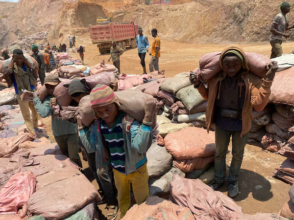
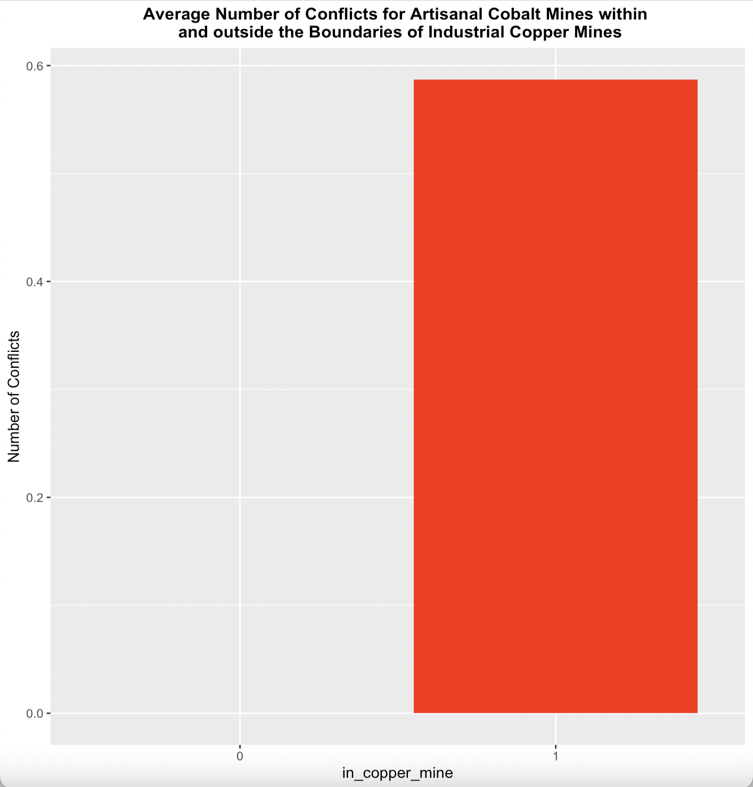

# Preliminary Research Results
2024 FIRE198 Sustainability Analytics

## Team Members

Luke Morelli

## Research Question

Do industrial mining companies provide protection against conflicts for
artisanal cobalt mines in the Democratic Republic of the Congo (DRC)?

## Background

Electric vehicles are an integral part of carving out a sustainable
future. However, ramping up their production has inevitably resulted in
a skyrocketing demand for numerous essential raw materials used in the
production of lithium-ion batteries, notably cobalt. The Democratic
Republic of the Congo (DRC) contains a staggering 70% of the world’s
cobalt reserves, with between 18% and 30% of that cobalt being sourced
artisanally. Due to the long and documented history between mining and
the proliferation of armed conflict in the DRC, many human rights
organizations are advocating for cobalt to be recognized as a conflict
mineral. Consequently, the DRC government is currently looking to
formalize their artisanal mining sector, and a key part of this process
is deciding where to place the largest artisanal mines. A logical choice
would be to place them adjacent to industrial copper mines since cobalt
is produced as a byproduct of copper mining; however, a recent study
from Dube and Vargas (2013) found that raw materials that were sourced
artisanally were less likely to cause conflict during price shocks than
raw materials sourced industrially. This paper seeks to verify Dube and
Vargas’ findings in the context of the DRC by analyzing whether
artisanal cobalt mines that are within the boundaries of an industrial
copper mine are more susceptible to conflict.



Artisanal miners struggle under the weight of 50kg sacks of cobalt ore
at the Shabara mine in the Democratic Republic of Congo (Siddharth
Kara).

## Data

**Outcome Variable**

The outcome variable for this experiment is the number of conflicts that
occur within a 2.5 kilometer radius of each cobalt mine between May 1,
2019 and October 31, 2020 (as this was the time period during which data
on artisanal cobalt mines is available). The conflict data was sourced
from the Armed Conflict Location & Event Data Project (ACLED), which
provides a location, time, and description of each documented conflict
in the region. Overall, there were 4,710 conflicts that met the criteria
to be used in the research. The conflict data can be exported from this
webpage: <https://acleddata.com/data-export-tool/>


The map above displays all of the conflicts that occurred in the
Democratic Republic of the Congo between May 1, 2019 and October 31,
2020. Each conflict is represented by a singular red circle on the map.

**Wrangling Methodology**

The following R code snippet contains the instructions for how to filter
the ACLED data to obtain solely the conflicts that occurred during the
specified time period

``` r
library("tidyverse")
library("terra")

#Read in the data
df_initial_conflicts <- read.csv(conflicts_pth)

#Filter by date
df_conflicts <- df_initial_conflicts %>%
  mutate(event_date = as.Date(event_date, format = "%d %B %Y")) %>%
  filter(event_date >= date_start & event_date <= date_end) 

#Convert back to shapefile
conflicts_shp <- vect(df_conflicts, geom=c("longitude", "latitude"), crs = "+proj=longlat +ellps=WGS84 +datum=WGS84 +no_defs")
```

**Treatment Variable**

The treatment variable for this experiment is whether an artisanal
cobalt mine is located within the boundaries of an industrial copper
mine. Thus, this research required data on the locations and dates of
opening/closing for both mine types.

Data on the locations of artisanal cobalt mines was sourced from the
International Peace Information Service (IPIS). For each mine visited by
the IPIS, the following data is provided: location of the mine, the time
at which it was visited, and the number of workers at the mine. Overall,
there were 52 artisanal cobalt mines that were visited by the IPIS and
met the criteria to be used in the research. The data on artisanal
cobalt mines may be extracted from the following webpage:
<https://www.ipisresearch.be/mapping/webmapping/drcongo/v6/#-3/28/5/4/1/>

Data on the location of industrial copper mines was sourced from the
Global Forest Watch dataset on industrial mining permits, which is
provided to them by the DRC’s Ministry of Mines. Each permit contains
information on the location of the potential mine, the minerals that are
allowed to be extracted there, the opening/closing date of the mine, and
the company to which the mining permit was granted. Overall, there were
163 industrial copper mines that met the criteria to be used in the
research. The data on industrial copper mines may be extracted from the
following webpage:
<https://data.globalforestwatch.org/datasets/3b4c0c91306c47abaec0c3fd46088242_5/explore>


The map above displays the boundaries of industrial copper mining
permits (in red) and the locations of artisanal cobalt mines (as points
in blue).

**Wrangling Methodology**

The following R code snippet demonstrates the process of filtering the
IPIS data to obtain the artisanal cobalt mines that were active during
the specified time period.

``` r
library("tidyverse")
library("terra")

#Read in the data
ipis_data <- read.csv(ipis_pth)

#Get first (least recent) and last (most recent) visit date for each mine
df_visit <- ipis_data %>%
  group_by(pcode) %>%
  summarize(first_visit = min(visit_date), last_visit = max(visit_date))

# Use stastics from the most recent visit for each mine
df_clean <- ipis_data %>%
  group_by(pcode) %>%
  arrange(desc(visit_date)) %>% 
  slice(1) 
df_merged <- merge(df_visit, df_clean, by="pcode", all.x = TRUE)

#Filter for only artisanal cobalt mines
df_cobalt_visit <- df_merged %>%
  filter(str_detect(mineral1, "Cobalt") | str_detect(mineral2, "Cobalt") | str_detect(mineral3, "Cobalt"))

#Convert back to shapefile
shp_cobalt_mine <- vect(df_cobalt_visit, geom=c("longitude", "latitude"), crs="+proj=longlat +ellps=WGS84 +datum=WGS84 +no_defs")
```

The following R code snippet illustrates the process of obtaining the
industrial copper mines that were active during the specified time
period

``` r
library("tidyverse")
library("foreign")
library("terra")

#Read in the data
df_permits <- read.dbf(df_permits_pth)
vect_permits_shape <- vect(df_permits_shape_pth, crs="+proj=longlat +ellps=WGS84 +datum=WGS84 +no_defs")

#Filter by date and by mineral (only obtain copper mines)
df_copper_permits <- df_permits %>%
  filter(!is.na(date_do), !is.na(date_de1)) %>%
  mutate(date_do = as.Date(date_do), date_de1 = as.Date(date_de1)) %>%
  filter(date_do <= date_start & date_de1 >= date_end) %>%
  mutate(resource=as.character(resource)) %>%
  filter(str_detect(resource, "Cu"))

#Convert back to shapefile
copper_mines <- merge(vect_permits_shape, df_copper_permits, by="objectid", all.y="true")
```

**Intersection Process**

Now that all of the data has been extracted and cleaned, it must be used
to calculate the number of conflicts that occurred within a 2.5
kilometer radius of each artisanal cobalt mine over the duration of the
specified time period. Additonally, it must be determined if each
artisanal cobalt mine is within the boundaries of an industrial copper
mine, as that information is required to compare the number of conflicts
between artisanal cobalt mines within and outside the boundaries of
industrial copper mines. This will require intersecting shapefiles by
utilizing the Terra package, which is demonstrated by the following R
code snippet:

``` r
library("tidyverse")
library("terra")

#Intersecting artisanal cobalt mines with industrial copper mines
all_intersections <- data.frame()
for(i in 1:nrow(copper_mines)) {
  copper_mine <- copper_mines[i,]
  intersections_cobalt <- terra::relate(copper_mine, shp_cobalt_mine, relation="intersects")
  intersections_cobalt_vec <- as.vector(intersections_cobalt)
  intersection_cobalt <- df_cobalt_visit[intersections_cobalt_vec,]
  if (nrow(intersection_cobalt) > 0) {
    intersection_cobalt$objectid <- copper_mine$objectid
    all_intersections <- rbind(all_intersections, intersection_cobalt)
  }
}

#Creating the 2.5km buffers around each artisanal cobalt mine
cobalt_centers <- centroids(shp_cobalt_mine)
cobalt_areas <- buffer(cobalt_centers, width=2500, capstyle="round")

#Intersecting conflicts with the 2.5km buffers
all_conflicts <- data.frame()
all_tribes <- data.frame()
for(i in 1:nrow(cobalt_areas)) {
  cobalt_mine <- cobalt_areas[i,]
  intersections_conflicts <- terra::relate(cobalt_mine, conflicts_shp, relation="intersects")
  intersections_conflict_vec <- as.vector(intersections_conflicts)
  intersection_conflict <- df_conflicts[intersections_conflict_vec,]
  if (nrow(intersection_conflict) > 0) {
    intersection_conflict$pcode <- cobalt_mine$pcode
    all_conflicts <- rbind(all_conflicts, intersection_conflict)
  }
}
```

Then, the intersections data must be filtered/cleaned and merged
together to ensure it is in the correct format for calculating our final
result. The R code snippet below demonstrates this process

``` r
library("tidyverse")

#Ensuring each cobalt mine intersects with only the closest copper mine (if it intersects with one at all)
df_cobalt_intersection <- all_intersections %>%
  group_by(pcode) %>%
  summarize(objectid = first(objectid))

#Merges cobalt/copper mine intersections with the copper mine data
df_copper_parties = merge(df_cobalt_intersection, df_copper_permits, by="objectid", all.Y=TRUE) %>%
  group_by(pcode) 
df_copper_parties <- df_copper_parties[,c("pcode","objectid", "parties")]

#Calculating the number of conflicts per cobalt mine
df_conflict_intersections <- all_conflicts %>%
  group_by(pcode) %>%
  summarize(num_conflicts = n())

#Merging the intersections conflicts data with the intersections copper mines data. in_copper_mine is a binary variable that represents whether an artisanal cobalt mine is within the boundaries of an industrial copper mine and company represents the company that was granted the industial mining permit.
final_df <- merge(df_copper_parties, df_cobalt_visit, by="pcode", all.y=TRUE)
final_df_finished <- merge(df_conflict_intersections, final_df, by="pcode", all.y=TRUE) %>%
  group_by(pcode) %>%
  mutate(parties = as.character(parties)) %>%
  summarize(num_conflicts = ifelse(is.na(num_conflicts), 0, num_conflicts), 
            in_copper_mine = ifelse(is.na(objectid), 0, 1), 
            company = ifelse(is.na(parties), "", first(parties)))

#Manually adding a new column representing the amount of conflicts that were specifically related to mining based on the conflict descriptions provided by the ACLED
final_df_finished$copper_conflicts <- c(0, 0, 0, 0, 0, 0, 0, 0, 0, 0, 0, 0, 1, 1, 0, 1, 1, 1, 0, 0, 0, 3, 0, 0, 0, 0, 0, 0, 0, 0, 0, 0, 0, 0, 1, 0, 0, 0, 0, 0, 0, 0, 0, 0, 0, 0, 0, 0, 0, 0, 1, 0)
```

## Preliminary Results

The following R code snippet provides a preview on how the final
dataframe is structured

``` r
library("tidyverse")

head(final_df_finished)
```

| pcode        | num_conflicts | in_copper_mine | company          | copper_conflicts |
|--------------|---------------|----------------|------------------|------------------|
| codmine03389 | 0             | 0              |                  | 0                |
| codmine03393 | 0             | 1              | BOSS MINING SPRL | 0                |
| codmine03396 | 0             | 0              |                  | 0                |
| codmine03398 | 0             | 0              |                  | 0                |
| codmine03402 | 0             | 1              | GECAMINES        | 0                |
| codmine03405 | 0             | 1              | GECAMINES        | 0                |

The table above shows the first five observations (out of the 52
artisanal cobalt mines) of the final dataframe. The num_conflicts column
represents the number of observed conflicts within 2.5 kilometers of
each artisanal cobalt mine while the copper_conflicts column is the
number of these conflicts that can be specifically attributed to mining.

**Final Results Graph:**



The bar graph above compares the average number of conflicts for
artisanal cobalt mines located within and outside the boundaries of
industrial copper mines. On average, there were 0.587 conflicts within
2.5 kilometers of artisanal cobalt mines situated within industrial
copper mines, whereas there were no conflicts for those outside
industrial copper mines. However, this finding is inconclusive due to
data limitations, particularly the small sample size. Out of the 52
artisanal cobalt mines analyzed, 46 were found within the boundaries of
industrial copper mines.

**Results by Industrial Mining Company**

| Copper Mining Company                | Average Number of Conflicts | Number of Mines |
|--------------------------------------|-----------------------------|-----------------|
| None                                 | 0.00                        | 6               |
| BOSS MINING SPRL                     | 0.00                        | 5               |
| CHEMAF MAKALA                        | 0.00                        | 3               |
| COMPAGNIE MINIERE DE MUSONOIE GLOBAL | 0.00                        | 1               |
| GECAMINES                            | 1.08                        | 24              |
| GOMA MINING Sprl                     | 0.00                        | 2               |
| KALUMINES Sprl                       | 0.00                        | 1               |
| KAMOTO COPPER COMPANY                | 0.00                        | 2               |
| KANSUKI SPRL                         | 0.00                        | 2               |
| SOCIETE MINIERE DE KOLWEZI           | 0.00                        | 4               |
| Swanmines                            | 0.00                        | 1               |
| TENKE FUNGURUME MINING               | 1.00                        | 1               |

The table above illustrates the average number of conflicts that occur
within a 2.5 kilometer radius of artisanal cobalt mines, categorized by
the industrial mining company whose copper mine the artisanal cobalt
mines lie within. Although the mining company Gecamines has the highest
number of average conflicts, this result also lacks statistically
significant due to data limitations. In the final dataframe there were
24 Gecamines mines, whereas no other company had more than five mines.
This is likely the reason why Gecamines was one of the two companies
whose mines experienced any conflicts at all.
